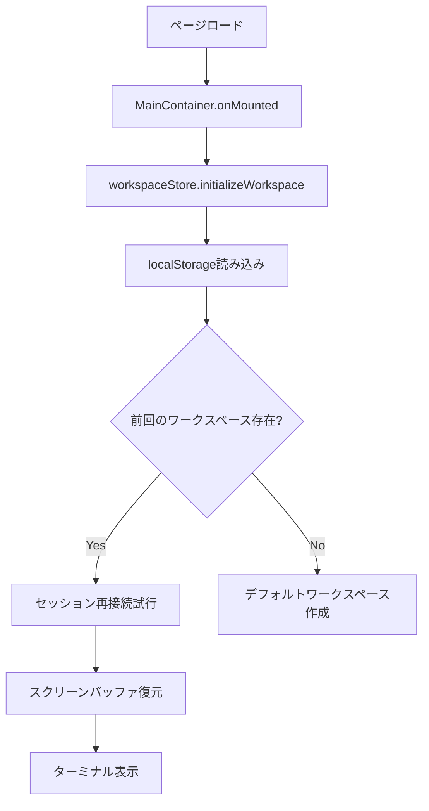

# セッション永続化実装概要

## 実装完了内容

### 1. セッション永続化機能
画面をリロードしても、前回のセッションに自動的に再接続し、ターミナルの内容を復元する機能を実装しました。

### 2. 主要コンポーネント

#### ワークスペース永続化 (`workspaceStore.ts`)
- ワークスペース情報（タブ、ペイン、セッションID）をlocalStorageに保存
- アプリケーション起動時に自動的に復元
- モジュール化により、以下のファイルに分割：
  - `workspace/persistenceManager.ts`: localStorage操作
  - `workspace/sessionManager.ts`: セッション再接続処理

#### スクリーンバッファ管理 (`screenBufferStore.ts`)
- ターミナル出力を最大5000行まで保存
- セッションごとにlocalStorageに永続化
- 再接続時に自動的に復元

#### セッション再接続 (`aetherTerminalStore.ts`)
- 既存セッションIDでサーバーへの再接続を試行
- `attemptSessionReconnection()`関数を追加
- 成功時: 既存セッションを継続
- 失敗時: 新規セッションを作成

### 3. 実装フロー



### 4. localStorage構造

```javascript
// ワークスペース関連
"aetherterm_workspaces": ["workspace_1234567890", ...],
"aetherterm_current_workspace": "workspace_1234567890",
"aetherterm_workspaces_workspace_1234567890": {
  id: "workspace_1234567890",
  name: "My Workspace",
  tabs: [{
    id: "tab_123",
    panes: [{
      id: "pane_456",
      sessionId: "aether_pane_456"
    }]
  }]
}

// スクリーンバッファ
"screen_buffer_aether_pane_456": {
  lines: [{
    content: "$ ls -la",
    timestamp: 1234567890,
    type: "input"
  }],
  currentLine: 42
}
```

### 5. 使用方法

1. **通常使用時**: 特別な操作は不要。すべて自動的に保存・復元されます
2. **手動保存**: `workspaceStore.saveCurrentWorkspace()`を呼び出し
3. **データクリア**: `WorkspacePersistenceManager.clearAll()`を実行

### 6. セキュリティ考慮事項
- パスワードや機密情報は保存しない
- セッションIDのみを保存し、認証情報は含まない
- 古いデータの自動削除機能（未実装）

### 7. パフォーマンス最適化
- スクリーンバッファは最大5000行に制限
- 大量データ書き込み時はdebounce処理
- 必要最小限のデータのみ保存

### 8. 今後の改善案
1. セッション有効期限の実装
2. 複数デバイス間での同期
3. セッションのエクスポート/インポート機能
4. より詳細な復元オプション（部分復元など）